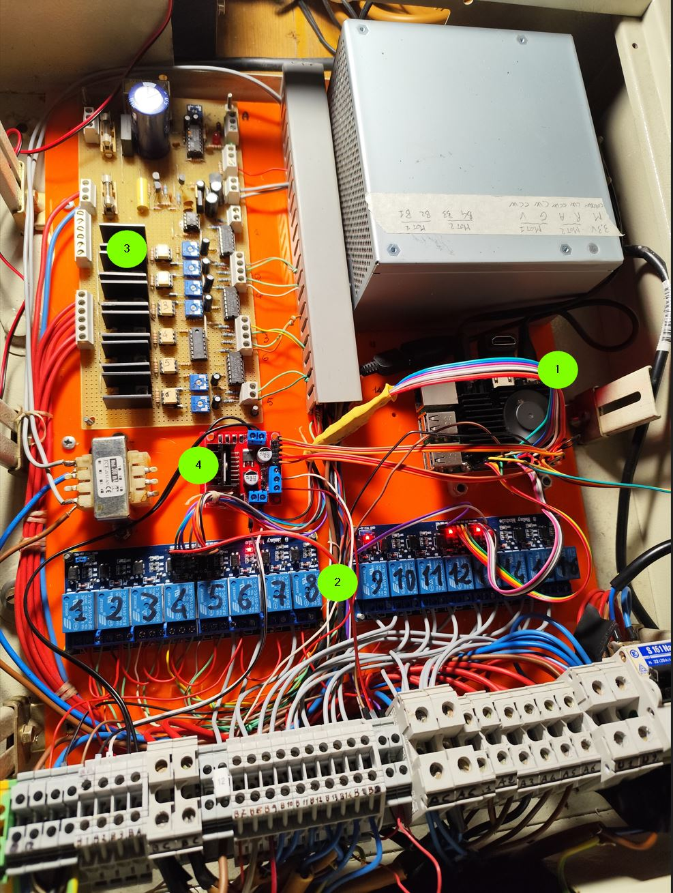

# Dunebugger

Dunebugger is a Python-based software that powers a Raspberry Pi to serve as the central control system for a very specific custom electronic circuit. The circuit consists of the Raspberry Pi and various digitally controlled hardware components, including relay boards, dimmer boards, and motor driver boards. This software is specifically developed to work with this custom hardware setup, enabling flexible configuration, management, and control of GPIO pins and associated components, supporting dynamic behaviors and interactive operation.

---

## Introduction
Dunebugger is part of a unique project designed to automate the lights, music, and special effects (such as water pumps and mechanical movements) of a nativity scene setup in a public space in Milan. This nativity scene, visited by thousands of people every Christmas season, is located in a Franciscan monastery and serves as a focal point of community celebration. The software and hardware combined enable a dynamic and immersive experience for visitors.

In addition to controlling physical components, the sequence system allows playing background music, randomly chosen from a list of audio files at each startup. It also supports playing single audio files during specific moments in the sequence to enhance the experience. For example, during a sunrise light effect, the system could play environmental sounds like a rooster crowing, dogs barking, or birds chirping.

---

## Features
- **GPIO Configuration**: Dynamically configure GPIO pins as inputs or outputs, assign descriptive names, and define logical mappings between GPIOs and physical hardware components like switches, relays, dimmers, and motors.
- **Sequence Management**: Define and execute complex sequences of actions for controlling relays, motors, and other devices using an easy-to-read configuration file.
- **Audio Integration**: Automatically play background music and trigger sound effects to synchronize with specific events in the sequence.
- **Terminal Interface**: Observe GPIO statuses, interact with the system, and execute commands via a terminal.
- **Event-Driven Behavior**: Respond to user inputs like button presses and other configured events to trigger actions or sequences.

---

## Hardware Requirements
1. **Raspberry Pi** (any version with GPIO support)
2. **Relay Boards** (digitally controlled, for switching high-voltage devices)
3. **Dimmer Board** (for controlling light brightness)
4. **Motor Driver Board** (for controlling motor speed and direction)
5. Various input devices (e.g., switches, sensors)


---

## Configuration Files
Dunebugger uses configuration files to manage GPIO settings, logical mappings, and action sequences.

### GPIO Configuration
Below is an example configuration for GPIO pin setup:

```ini
[Channels]
chan_out_releA = 5,11,9,10,22,27,17,4
chan_out_releB = 21,20,16,12,7,8,25,24
chan_out_motor_1 = 18,1,23
chan_out_motor_2 = 13,3,2
chan_in_contr = 6
chan_in_limitswitch_motor1 = 0,26
chan_in_limitswitch_motor2 = 14,15

[ChannelsSetup]
chan_out_releA = OUT, HIGH
chan_out_releB = OUT, HIGH
chan_out_motor_1 = OUT, LOW
chan_out_motor_2 = OUT, LOW
chan_in_contr = IN, DOWN
chan_in_limitswitch_motor1 = IN, DOWN
chan_in_limitswitch_motor2 = IN, DOWN

[LogicalChannels]
Rele1 = chan_out_releA[0]
Rele2 = chan_out_releA[1]
Motor1PWM = chan_out_motor_1[0]
Motor1In1 = chan_out_motor_1[1]
Motor1In2 = chan_out_motor_1[2]
In_StartButton = chan_in_contr[0]
```

### Action Sequences
Define sequences of events and actions in a configuration file:

```ini
0 switch LuceStartButton Off
0 switch PompaAcqua On
10 switch Case1 Off
17 switch Case2 Off

1:23 switch Case1 On
1:25 switch Case2 On
2:07 motor start 1 ccw 92
2:08 switch Ombre1 On
2:23 motor start 2 ccw 85
2:50 switch Ombre2 Off
4:00 switch DimGiorno On
4:16 switch Case2 Off
```

---

## Terminal Commands
Interact with the system using terminal commands to observe statuses, reload configurations, or trigger actions. Examples:

```ini
[Commands]
h = handle_help, "help"
s = handle_show_gpio_status, "show GPIO status"
t = handle_show_configuration, "show dunebugger conf"
l = handle_load_configuration, "reload dunebugger conf"
quit = handle_quit, "quit"
c = handle_cycle_start, "cycle start"
cs = handle_cycle_stop, "cycle stop (send stop signal)"
mi = handle_initialize_motor_limits, "motor init"
```

---

## Installation
1. Clone the repository:
   ```bash
   git clone https://github.com/your-repo/dunebugger.git
   ```
2. Install required Python libraries:
   ```bash
   pip install -r requirements.txt
   ```
3. Connect the Raspberry Pi to the hardware components as per your circuit design.

---

## Usage
1. Set up the GPIO configuration file based on your hardware.
2. Define your action sequences in the appropriate file.
3. Start the application:
   ```bash
   python dunebugger.py
   ```
4. Interact with the system using the terminal or wait for configured events to trigger actions.

---

## Contribution
Contributions are welcome! Feel free to open an issue or submit a pull request.

---

## License
This project is licensed under the MIT License. See the `LICENSE` file for details.

---

## Acknowledgments
Special thanks to the open-source community and contributors who helped make this project possible!
